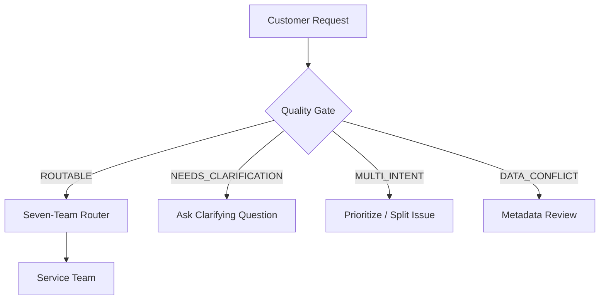

# Kestrel Home — Service Request Routing

> An end-to-end machine learning system that routes Kestrel Home customer service requests to the correct service team, using a **Quality Gate → Seven-Team Router** architecture.


---

## Table of Contents

1. [Results at a Glance](#results-at-a-glance)
2. [Overview](#overview)
3. [System Architecture](#system-architecture)
4. [Service Teams](#service-teams)
5. [Dataset](#dataset)
6. [Operational Target Audit](#operational-target-audit)
7. [Modeling Approach](#modeling-approach)
8. [Experiments](#experiments)
9. [Validation Strategy](#validation-strategy)
10. [Evaluation Results](#evaluation-results)
11. [Error Analysis](#error-analysis)
12. [Leakage Controls](#leakage-controls)
13. [Prediction Generation](#prediction-generation)
14. [API](#api)
15. [Streamlit UI](#streamlit-ui)
16. [Installation and Usage](#installation-and-usage)
17. [Testing](#testing)
18. [Repository Structure](#repository-structure)
19. [Business Considerations](#business-considerations)
20. [Deployment and Monitoring](#deployment-and-monitoring)
21. [Handoff Priorities](#handoff-priorities)
22. [Limitations](#limitations)
23. [Confidentiality](#confidentiality)
24. [AI Usage](#ai-usage)
25. [Final Recommendation](#final-recommendation)

---

## Results at a Glance

| Metric | Result |
|---|---:|
| Historical bot accuracy vs `final_team` | **76.67%** |
| Final seven-team router accuracy | **84.62%** |
| Improvement over historical bot | **+7.95 pp** |
| Seven-team router macro F1 | **84.02%** |
| Seven-team router weighted F1 | **84.67%** |
| Quality-gate accuracy | **94.09%** |
| Quality-gate macro F1 | **91.91%** |
| Automatic-routing coverage | **59.45%** |
| Automatic-routing accuracy | **97.36%** |
| Automatic-routing macro F1 | **97.22%** |
| Requests withheld for clarification / data-quality handling | **40.55%** |

> **Important:** 97.36% is the accuracy on the *automatically routed* validation subset (59.45% of requests). It is **not** overall system accuracy. The system is designed to withhold ambiguous requests rather than force them into a team.

All figures are measured on a chronological validation holdout (2,165 requests).

---

## Overview

Kestrel Home Appliances receives service requests through chat, WhatsApp, IVR and email. Each request must reach one of seven service teams. The existing process relies on a vendor routing bot.

**The key finding.** The original requirement was to match the historical routing label (`team_label`) with ≥ 90% accuracy. Analysis of the resolution log showed that `team_label` is the bot's *initial* decision, not the team that ultimately resolved the request:

- 10,822 historical requests
- 2,471 requests (**22.83%**) ended with a different team than the bot's initial routing
- Bot agreement with `final_team`: **77.17%**
- Requests with at least one transfer: 2,696 (**24.91%**)

Optimizing for `team_label` would mainly reproduce the system being replaced. This project therefore uses **`final_team` as the operational target** and measures improvement against the historical bot on the same holdout.

**Design principle.** The solution is a *selective routing system*: clear requests are routed automatically with high accuracy, while ambiguous, multi-intent or conflicting requests are withheld for human or data-quality handling.

The solution runs entirely locally on a scikit-learn pipeline. No paid LLM or external AI API is required.

---

## System Architecture

### 1. Quality Gate and Selective Routing

Every incoming request passes through a quality gate that decides whether it is safe to route automatically.

```text
                       CUSTOMER REQUEST
                              │
                              ▼
                 ┌──────────────────────┐
                 │     QUALITY GATE     │
                 └──────────┬───────────┘
                            │
          ┌─────────────────┼──────────────────┐
          │                 │                  │
          ▼                 ▼                  ▼
      ROUTABLE       NEEDS_CLARIFICATION   MULTI_INTENT
          │                 │                  │
          ▼                 ▼                  ▼
    7-TEAM ROUTER      Ask Question       Prioritize /
          │                                 Split Issue
          ▼
    SERVICE TEAM

                       DATA_CONFLICT
                             │
                             ▼
                     Metadata Review
```

| Gate outcome | Meaning | Action |
|---|---|---|
| `ROUTABLE` | Clear single intent, consistent metadata | Send to the seven-team router |
| `NEEDS_CLARIFICATION` | Insufficient information (e.g. "please call back") | Ask the customer a clarifying question |
| `MULTI_INTENT` | Request spans more than one team's scope | Prioritize or split into separate issues |
| `DATA_CONFLICT` | Request text conflicts with metadata | Send to metadata review |

The same flow as a Mermaid diagram:



### 2. End-to-End Platform

```text
┌──────────────┐     ┌────────────────┐     ┌───────────────────────────┐
│ Streamlit UI │────▶│ FastAPI Service │────▶│ Persisted Model Artifact  │
│  app/ui.py   │     │  app/main.py    │     │ models/kestrel_router.    │
└──────────────┘     │ GET  /health    │     │ joblib                    │
                     │ POST /route     │     └─────────────┬─────────────┘
                     └────────────────┘                   │
                                                          ▼
                                        ┌──────────────────────────────────┐
                                        │ Quality Gate → Seven-Team Router │
                                        └──────────────────────────────────┘
```

| Layer | Component | Responsibility |
|---|---|---|
| Presentation | Streamlit (`app/ui.py`) | Interactive testing; shows predicted team and explanation |
| Service | FastAPI (`app/main.py`) | `GET /health`, `POST /route`; applies the training-time feature pipeline |
| Decision | Quality Gate + Router | Decides *whether* to route, then *where* |
| Model | scikit-learn pipeline (joblib) | TF-IDF + metadata + engineered features → LinearSVC |
| Evidence | `evaluation/`, `outputs/` | Metrics, error analysis, predictions |

### 3. Model Pipeline

```text
                      Request Text
                            │
              ┌─────────────┴─────────────┐
              ▼                           ▼
        Word TF-IDF              Character TF-IDF
        (1–2 grams)               (char_wb, 3–5)
              │                           │
              └─────────────┬─────────────┘
                            │
      Request-time metadata (one-hot encoded)
      channel · product_family · warranty_status · source
                            │
      Engineered features (scaled)
      length · counts · intent indicators
                            │
                            ▼
                  Feature Concatenation
                            │
                            ▼
                        LinearSVC
                            │
                            ▼
                     Predicted Team
```

### 4. Development Workflow

```text
Historical Data → EDA → Operational Target Audit → Target = final_team
      → Cleaning & Team Normalization → Chronological Validation
      → NLP Feature Engineering → Model Experiments → Error Analysis
      → Final Model → Prediction Generation → FastAPI → Streamlit UI
      → Automated Testing
```

---

## Service Teams

| Team | Primary Responsibility |
|---|---|
| Billing | Invoices, GST, payment issues, refunds, EMI and coupons |
| Filters & Consumables | Filters, candles, membranes, jars, brushes, blades, AMC kits and spares |
| Installs & Demo | Product installation, demonstrations and wall mounting |
| Product Advice | Product usage and pre/post-purchase questions without a fault |
| Repairs | Faults, breakdowns, error codes, leaks, noise and technician-required issues |
| Returns & Replacement | Damaged, wrong or incomplete deliveries, returns and exchanges |
| Warranty Claims | Warranty registration, coverage and claim requests |

**Team-name normalization.** Two historical names are normalized before training and evaluation:

```text
Installations → Installs & Demo
Consumables   → Filters & Consumables
```

---

## Dataset

Approximately 18 months of labelled historical service requests.

| Dataset | Rows | Period |
|---|---:|---|
| Training | 10,822 | 2025-04-01 → 2026-06-30 |
| Test (unlabelled) | 2,178 | 2026-07-01 → 2026-09-30 |

**Training schema:** `request_id`, `created_at_ist`, `channel`, `product_family`, `warranty_status`, `request_text`, `source`, `team_label`

**Resolution log schema:** `request_id`, `first_team`, `final_team`, `transfers`, `resolved_at`. Used for the operational target and post-hoc analysis only; never as a model input.

**Sources:** requests originate from the CRM and from legacy Zoho. Because the migration occurred during the data period, `source` is treated as a request-time feature.

---

## Operational Target Audit

The resolution log was joined to the training data on `request_id`.

| Measure | Result |
|---|---:|
| Historical requests | 10,822 |
| Bot agreement with final team | **77.17%** |
| Historical mismatches | **2,471** |
| Historical mismatch rate | **22.83%** |
| Requests with ≥ 1 transfer | **2,696** |
| Transfer rate | **24.91%** |

Mismatch rate by the bot's initial team:

| Initial Team | Mismatch Rate |
|---|---:|
| Filters & Consumables | 40.19% |
| Repairs | 36.31% |
| Billing | 35.33% |
| Product Advice | 3.81% |
| Warranty Claims | 3.65% |
| Returns & Replacement | 3.58% |
| Installs & Demo | 3.29% |

This audit is the primary reason the final model targets `final_team` instead of `team_label`.

---

## Modeling Approach

**Inputs (request-time only):** `request_text`, `channel`, `product_family`, `warranty_status`, `source`

**Target:** `final_team`

### Feature Engineering

| Group | Details |
|---|---|
| Word TF-IDF | `ngram_range=(1,2)`, `min_df=2`, `sublinear_tf=True` |
| Character TF-IDF | `analyzer=char_wb`, `ngram_range=(3,5)`, `min_df=2`, `sublinear_tf=True`; robust to misspellings and noisy text |
| Categorical | One-hot: channel, product_family, warranty_status, source |
| Text statistics | Text length, word count, question-mark, exclamation-mark, digit and rupee-symbol counts, order-ID indicator |
| Intent indicators | Pattern-based counts for repair, installation, billing, warranty, return/replacement, consumables and product-advice intent |

### Classifier

```text
LinearSVC
C            = 2.0
class_weight = "balanced"
max_iter     = 10000
```

`class_weight="balanced"` accounts for differing team frequencies. LinearSVC is not probability-calibrated, so no artificial probability score is exposed.

### Tools and Technologies

| Area | Stack |
|---|---|
| Language | Python 3.12+ |
| ML | scikit-learn (LinearSVC, TF-IDF, OneHotEncoder, StandardScaler) |
| Data | pandas, NumPy, SciPy |
| Persistence | joblib |
| Backend | FastAPI, Uvicorn, Pydantic |
| Frontend | Streamlit |
| Testing | pytest, FastAPI TestClient, HTTPX |

---

## Experiments

**Historical-label experiments.** The best model against `team_label` reached **96.49%** accuracy. It exceeded the original 90% requirement but was not adopted as the operational objective after the resolution-outcome analysis.

**Operational experiments (target `final_team`).** All compared under the same chronological validation:

1. Word TF-IDF + LinearSVC
2. Word + character TF-IDF
3. Text + request-time metadata
4. Text + metadata + engineered intent features ← **selected**
5. Policy-aware intent features
6. Hierarchical routing experiment

---

## Validation Strategy

A random split was deliberately avoided. Data was sorted chronologically and split 80/20 to better approximate deployment.

| Split | Rows | Period |
|---|---:|---|
| Training (earlier 80%) | 8,657 | 2025-04-01 00:31 → 2026-03-30 19:44 |
| Validation (later 20%) | 2,165 | 2026-03-30 20:18 → 2026-06-30 23:33 |

---

## Evaluation Results

### Seven-team router vs historical bot

| Model | Target | Accuracy |
|---|---|---:|
| Historical routing bot | `final_team` | 76.67% |
| Final operational model | `final_team` | **84.62%** |
| **Improvement** | | **+7.95 pp** |

| Metric | Score |
|---|---:|
| Accuracy | 84.62% |
| Macro F1 | 84.02% |
| Weighted F1 | 84.67% |

### Per-team F1

| Team | F1 |
|---|---:|
| Repairs | **89.37%** |
| Installs & Demo | 85.36% |
| Billing | 84.80% |
| Returns & Replacement | 83.38% |
| Warranty Claims | 82.24% |
| Filters & Consumables | 81.92% |
| Product Advice | 81.08% |

### Selective routing (Quality Gate + Router)

| Metric | Result |
|---|---:|
| Quality-gate accuracy | 94.09% |
| Quality-gate macro F1 | 91.91% |
| Automatic-routing coverage | 59.45% |
| Automatic-routing accuracy | 97.36% |
| Automatic-routing macro F1 | 97.22% |
| Withheld for clarification / data-quality handling | 40.55% |

The 90%+ accuracy requirement is met for requests selected for automatic routing, rather than by forcing ambiguous requests into a team.

### Historical bot vs model (same holdout)

| Outcome | Requests |
|---|---:|
| Both correct | 1,589 |
| Old bot wrong → model correct | **243** |
| Old bot correct → model wrong | **71** |
| Both wrong | 262 |

The model corrected far more bot errors than it introduced, indicating it is not merely reproducing historical routing behavior.

---

## Error Analysis

```text
Validation requests : 2,165
Correct             : 1,832
Incorrect           :   333
Error rate          : 15.38%
```

**Largest confusion pairs:** Returns → Billing, Repairs → Warranty, Warranty → Returns, Returns → Product Advice, Product Advice → Warranty, Installs → Product Advice, Repairs → Returns, Repairs → Installs, Installs → Filters & Consumables. Errors concentrate where text is short or carries multiple intents.

| Channel | Error Rate | | Product Family | Error Rate |
|---|---:|---|---|---:|
| WhatsApp | 16.04% | | Robot Vacuum | 20.45% |
| IVR | 16.04% | | Mixer Grinder | 16.91% |
| Email | 14.78% | | Room Heater | 16.73% |
| Chat | 14.37% | | Induction Cooktop | 15.61% |
| | | | Ceiling Fan | 14.51% |
| | | | Air Fryer | 13.37% |
| | | | Water Purifier | 13.06% |

| Warranty Status | Error Rate |
|---|---:|
| In warranty | 16.02% |
| Out of warranty | 15.71% |
| Shield | 13.35% |

Examples of intrinsically ambiguous requests: *"need help with my purifier"*, *"mixer grinder query"*, *"please call back"*. These motivate the quality gate.

---

## Leakage Controls

**Excluded from model features:** `team_label`, `first_team`, `final_team`, `transfers`, `resolved_at`

**Used (available at request creation):** `request_text`, `channel`, `product_family`, `warranty_status`, `source`, and text-derived features.

`team_label` is retained only as a historical benchmark; `final_team` is the evaluation target, never an input.

---

## Prediction Generation

The final model is retrained on the full labelled training set and predicts all 2,178 test requests.

- **Output:** `outputs/predictions.csv` with columns `request_id,team`
- **Checks performed:** 2,178 rows, 2,178 unique request IDs, no missing predictions, no invalid team names, all seven teams represented, correct column names

---

## API

```bash
uvicorn app.main:app --reload
```

| Endpoint | Description |
|---|---|
| `GET /health` | Service and model status |
| `POST /route` | Route a single request |

**Example request**

```json
{
  "request_text": "My water purifier is leaking and not working.",
  "product_family": "Water Purifier",
  "warranty_status": "in_warranty",
  "channel": "whatsapp",
  "source": "crm"
}
```

**Example response**

```json
{
  "predicted_team": "Repairs",
  "reason": "The request contains product-fault or service-problem language, so it is routed to Repairs."
}
```

The API loads the persisted model artifact and reproduces the training-time feature pipeline.

---

## Streamlit UI

```bash
streamlit run app/ui.py
```

Enter request text, product family, warranty status, channel and source. The UI calls the FastAPI service and displays the predicted team with a routing explanation.

---

## Installation and Usage

```bash
# 1. Clone
git clone <PRIVATE_REPOSITORY_URL>
cd kestrel-service-routing

# 2. Virtual environment
python3 -m venv .venv
source .venv/bin/activate

# 3. Dependencies
pip install -r requirements.txt

# 4. Train the final model (writes models/kestrel_router.joblib and outputs/predictions.csv)
python src/train_final.py

# 5. Run tests
python -m pytest -q

# 6. Start the API
uvicorn app.main:app --reload

# 7. Start the UI (new terminal)
streamlit run app/ui.py
```

---

## Testing

```bash
python -m pytest -q
```

Current result: **5 passed**. A dependency-level deprecation warning from the FastAPI/Starlette testing stack may appear; it is not a test failure.

---

## Repository Structure

```text
kestrel-service-routing/
├── app/
│   ├── main.py                 # FastAPI service
│   └── ui.py                   # Streamlit UI
├── data/                       # Confidential client data
│   ├── train.csv
│   ├── test_unlabelled.csv
│   ├── resolution_log.csv
│   ├── teams.csv
│   ├── sample_submission.csv
│   └── README.txt
├── evaluation/
│   ├── model_comparison.csv
│   ├── model_evidence.md
│   ├── final_error_analysis.md
│   ├── final_model_confusion_matrix.csv
│   ├── final_model_confusion_pairs.csv
│   ├── final_model_errors_by_channel.csv
│   ├── final_model_errors_by_product.csv
│   ├── final_model_errors_by_warranty.csv
│   ├── bot_vs_model_cases.csv
│   ├── operational_target_audit.csv
│   ├── routing_mismatch_matrix.csv
│   ├── team_label_to_final_team.csv
│   └── representative_hard_cases.csv
├── models/
│   └── kestrel_router.joblib
├── outputs/
│   └── predictions.csv
├── src/
│   ├── train_final.py
│   ├── create_evidence.py
│   ├── error_analysis.py
│   └── ...
├── tests/
├── references/
├── requirements.txt
└── README.md
```

---

## Business Considerations

The operations policy specifies ₹305 per transfer, ₹260 average additional contact for a misdirected request, a ₹540 technician visit, and an existing bot cost of ₹3.2 lakh/year.

The historical data records 3,902 transfers across 2,696 requests. A policy-based illustration:

```text
3,902 transfers × ₹305 = ₹11,90,110
2,471 mismatches × ₹260 = ₹6,42,460
Combined illustrative amount = ₹18,32,570
```

> These figures are **not audited savings estimates**. They illustrate the potential operational impact of routing and transfer events over the historical period.

The central business finding is the routing gap: 22.83% of historical requests ended on a different team than the bot's initial routing. The model improves same-holdout operational accuracy from 76.67% to 84.62%, and selective routing reaches 97.36% on the automatically routed subset. Actual savings should be claimed only after production monitoring.

---

## Deployment and Monitoring

| Area | What to track |
|---|---|
| Routing accuracy | Final-team accuracy, macro F1, per-team precision/recall, confusion patterns |
| Transfer rate | Requests requiring reassignment ÷ total requests (the most operational metric) |
| Gate behavior | Share of requests per gate outcome; coverage vs accuracy trade-off |
| Human escalation | Fallback path for low-confidence and ambiguous requests |
| Data drift | Product mix, channel mix, customer vocabulary, warranty and team distributions |
| Retraining | Periodic retraining on newly resolved requests against latest outcomes |

---

## Handoff Priorities

1. **Validate against live outcomes.** Run in shadow mode and compare predictions with the teams that ultimately resolve requests.
2. **Monitor routing quality.** Transfer rate, final-team agreement, per-team error rates, high-volume confusion pairs.
3. **Establish a feedback loop.** Store `request → prediction → actual final team → transfer outcome → resolution` so future models learn from real outcomes rather than historical bot decisions.

---

## Limitations

- The model is trained on historical `final_team` outcomes, which themselves reflect past process quality.
- Short and multi-intent requests remain intrinsically hard; roughly 40% of validation requests are withheld by the gate.
- LinearSVC is not probability-calibrated, so confidence scores are not exposed.
- Robot Vacuum requests and WhatsApp/IVR channels show the highest error rates.
- Cost figures are policy-based illustrations, not audited savings.
- Results come from a single chronological holdout; production shadow testing is required before retiring the existing process.

---

## Confidentiality

The assignment data is confidential client data. Customer-level records and internal operational artifacts must not be published. The repository is intended to remain private where required.

---

## AI Usage

AI assistance was used for debugging, code-structure review, documentation, reasoning about evaluation and leakage, error-analysis workflows, and API/UI review. The production routing model is a locally executable scikit-learn pipeline and does **not** depend on a paid LLM API.

---

## Final Recommendation

Run a **controlled pilot or shadow deployment** rather than immediately retiring the existing routing process. The system should:

1. Automatically route high-confidence requests.
2. Ask for clarification when information is insufficient.
3. Detect metadata/text conflicts.
4. Handle multi-intent requests explicitly.
5. Measure actual final-team outcomes and transfer rates in production.
6. Increase automatic-routing coverage only while quality remains acceptable.

| Measure | Result |
|---|---:|
| Historical bot vs `final_team` | 76.67% |
| Final seven-team router | 84.62% |
| Improvement | +7.95 pp |
| Quality-gate accuracy | 94.09% |
| Automatic-routing coverage | 59.45% |
| Automatic-routing accuracy | 97.36% |
| Automatic-routing macro F1 | 97.22% |

> **Bottom line:** evaluate this project as a **selective routing system**, not as a model claiming 97.36% accuracy on every incoming request.
